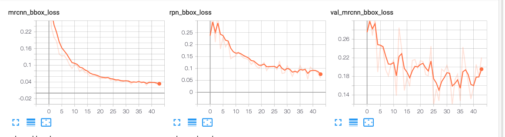

<p align="center">

</p>

TACO is a growing image dataset of waste in the wild. It contains images of litter taken under
diverse environments: woods, roads and beaches. These images are manually labeled and segmented
according to a hierarchical taxonomy to train and evaluate object detection algorithms. Currently,
images are hosted on Flickr and we have a server that is collecting more images and
annotations @ [tacodataset.org](http://tacodataset.org)


<div align="center">
  <div class="column">
    
    
    
    
    
  </div>
</div>
</br>

If you use this dataset and API in a publication, please cite us: &nbsp;
```
@misc{Taco19,
  author       = {Pedro F. Proença and Pedro Simões},
  title        = {TACO: Trash Annotations in Context Dataset},
  year         = 2019,
  doi          = {10.5281/zenodo.3242156},
  url          = {http://tacodataset.org}
}
```
For convenience, annotations are provided in COCO format. Check the metadata here:
http://cocodataset.org/#format-data

TACO is still relatively small, but it is growing. Stay tuned!


## Results
This is tensorboard scalars with 50 Epochs.

