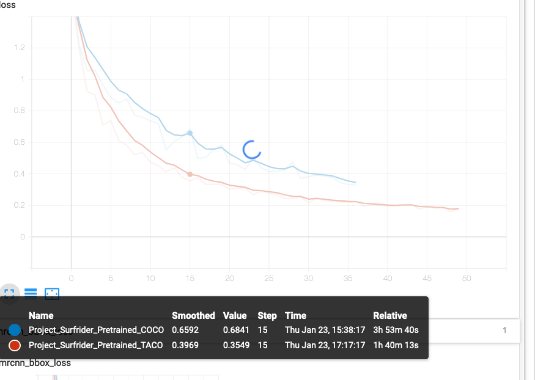

# Project-Surfrider

Instructions and code for the course project - based on ONG Surfrider detection of plastics in rivers.

## Surfrider - Plastic Monitoring on Rivers

This course project makes use of an ongoing open source project led by [Surfrider Europe](https://surfrider.eu/), which aims at quantifying plastic pollution in rivers through space and time.
Plastic Waste in oceans mostly comes from rivers (80%), and it is very difficult to assess precisely where they come from.
This will be used to monitor river banks to take local decisions, measure effectiveness of policies at local and global scales, and has thus a very concrete importance.

In practice, video streams are captured on river banks from kayaks (with their geolocalisation), and then fed to a model which aims at quantifying the number and types of objects.
In the first version, there are three types (classes) of plastic litter:
- Plastic Bottles: 
- Plastic Fragments: 
- Other types of waste

Your goal is to build a short project around plastic detection using modern Deep Learning algorithms.

# Mask R-CNN for Object Detection and Segmentation

This is an implementation of [Mask R-CNN](https://arxiv.org/abs/1703.06870) on Python 3, Keras, and TensorFlow. The model generates bounding boxes and segmentation masks for each instance of an object in the image. It's based on Feature Pyramid Network (FPN) and a ResNet101 backbone.

The repository includes:
* Source code of Mask R-CNN built on FPN and ResNet101.
* Training code for MS COCO
* Pre-trained weights for MS COCO
* Jupyter notebooks to visualize the detection pipeline at every step
* ParallelModel class for multi-GPU training
* Evaluation on MS COCO metrics (AP)
* Example of training on your own dataset

# Mask-RCNN and Taco transfer learning 

Using pre-trained COCO weights trained on http://tacodataset.org/ as in https://github.com/pedropro/TACO.

